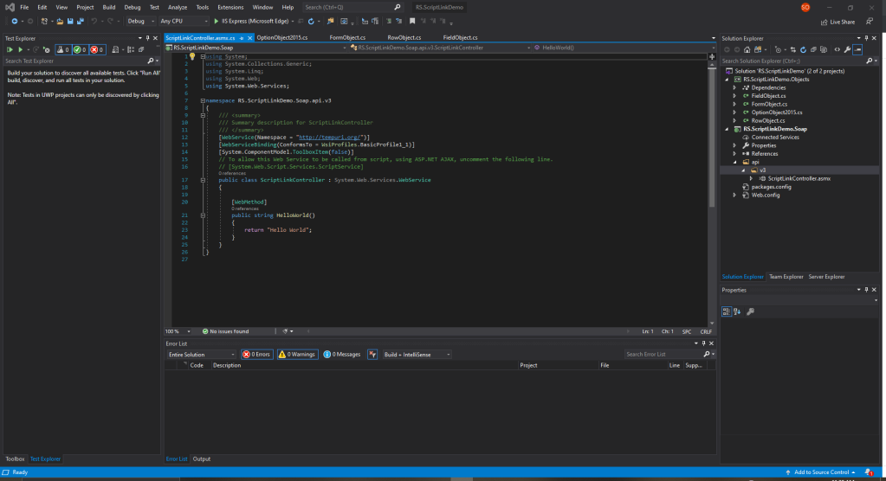

:::info
This post was originally published on the RarelySimple Blog. It has been republished here to be with other ScriptLink-related content.
:::

Most of my IT career has involved the implementation, maintenance, and configuration of electronic health record (EHR) solutions in the behavioral health space.
Much of this work has been the usual suspects of security, report writing, end user support, and process design.
However, it has also involved a healthy dose of extending the EHR to add additional features and capabilities.
The Netsmart myAvatar EHR solution includes a variety of options for extending the solution.

In this series of articles, we will be looking at the myAvatar ScriptLink feature.
ScriptLink is a feature that enables a form in myAvatar to connect to a separate web application (consume a SOAP API) to interact with the form or trigger additional processes, such as sending an email.
A common example of how to use ScriptLink is to score a clinical outcomes tool and provide a prompt.

{/* truncate */}

For example, a clinician completes a general Assessment and upon filing, ScriptLink calls the API which evaluates the responses and determines based on the results that the client may be at risk of death by suicide so a Suicide Risk Assessment is recommended and give the option to open that form at that moment.
ScriptLink could then extend the functionality of the Suicide Risk Assessment to trigger notifications or create a Chart Alert based on the responses.

To leverage the ScriptLink feature in your environment you will need access to a developer or development team that can create the web application and API.
You will also need to host the solution in your server room, data center, or in Netsmart’s cloud hosting.

This series is written for the developer who may new to ScriptLink or even development.
The goal is to help you get started.
Much of the series will look at development in .NET using C# and hosting using Windows Server and IIS.
However, this will not be exclusively so.
I intend to explore some other frameworks, languages, and hosting solutions in this series and the future as well.

## What You Will Need

Before we begin you will need the following.

* [Visual Studio 2019](https://visualstudio.microsoft.com/vs/)<br />Community edition is free and will work fine for this series.

## Create a Class Library

:::tip
You can skip a number of these steps by using the AvatarScriptLink.NET library instead. It is available for free on NuGet and simplifies ScriptLink API development. [Learn more](/docs/dotnet/intro).
:::

The first thing we will do is create a .NET Standard Class Library to define the OptionObject that we will receive from myAvatar.
We will simplify and enhance this by using a NuGet package in the future.
However, this will help to familiarize you with the OptionObject definition.

1. Launch **Visual Studio 2019** and select **Create a new project**.


2. Set the Language filter to **C#**.
3. Optional:
    1. Set the Project Type filter to **Library** or
    2. Search for **Class Library**.
4. Select the **Class Library (.NET Standard)** Project and select **Next**.


5. **Name the Project**. I am going to use RS.ScriptLinkDemo.Objects.
6. Optional: Change the Location.
7. **Name the Solution**. I am going to use RS.ScriptLinkDemo.
8. Uncheck Place solution and project in the same directory.
9. Select **Create**.


10. Visual Studio will now scaffold your project. When complete, you should see your solution and project with a sample class (Class1) open for editing.

## Create the Object Classes

Now that we have our Class Library project we will create our classes to define an OptionObject2015. Let’s go ahead and delete the default Class1.cs file that was created for us. You can also rename it if you like to use it for one of the upcoming classes.

### The FieldObject

The FieldObject holds the content and metadata about a field located in myAvatar.

1. Right-click on your project and select **Add->Class…**
2. Name the class **FieldObject.cs** and select **Add**.
3. You should now have a FieldObject class open and ready to define.
4. **Set the class as public** and add the following properties.

```cs
public class FieldObject
{
    public string Enabled { get; set; }
    public string FieldNumber { get; set; }
    public string FieldValue { get; set; }
    public string Lock { get; set; }
    public string Required { get; set; }
}
```

5. Optional: Right-click and select **Remove and Sort Usings**.
6. **Save** changes.

### The RowObject

The RowObject defines a row on a myAvatar form. This includes a List of FieldObjects and some metadata about the row. The row is most prominent in myAvatar when using multiple iteration tables.

1. Right-click on your project and select **Add->Class…**
2. Name the class **RowObject.cs** and select **Add**.
3. You should now have a RowObject class open and ready to define.
4. **Set the class as public** and add the following properties.

```cs
public class RowObject
{
    public List<FieldObject> Fields { get; set; }
    public string ParentRowId { get; set; }
    public string RowAction { get; set; }
    public string RowId { get; set; }
}
```

5. Optional: Right-click and select **Remove and Sort Usings**.
6. **Save** changes.

### The FormObject

The name of the FormObject dates back to before myAvatar was released. A FormObject represents a section of a myAvatar Form. In myAvatar Form Sections are list in the top-left below the tabs and above the controls. Each FormObject ("section") will contain at least 1 RowObject. The first/principal FormObject will only contain 1 RowObject.

1. Right-click on your project and select **Add->Class…**
2. Name the class **RowObject.cs** and select **Add**.
3. You should now have a RowObject class open and ready to define.
4. **Set the class as public** and add the following properties.

```cs
public class FormObject
{
    public RowObject CurrentRow { get; set; }
    public string FormId { get; set; }
    public bool MultipleIteration { get; set; }
    public List<RowObject> OtherRows { get; set; }
}
```

5. Optional: Right-click and select **Remove and Sort Usings**.
6. **Save** changes.

### The OptionObject

There are currently three different versions of the OptionObject: OptionObject (legacy), OptionObject2 (legacy), and OptionObject2015 (current). We will use OptionObject2015 as it is the current version and is required if you will use ScriptLink with Avatar Web Services. The OptionObject represents the myAvatar Form.

1. Right-click on your project and select **Add->Class…**
2. Name the class **RowObject.cs** and select **Add**.
3. You should now have a RowObject class open and ready to define.
4. **Set the class as public** and add the following properties.

```cs
public class OptionObject2015
{
    public string EntityID { get; set; }
    public double EpisodeNumber { get; set; }
    public double ErrorCode { get; set; }
    public string ErrorMesg { get; set; }
    public string Facility { get; set; }
    public List<FormObject> Forms { get; set; }
    public string NamespaceName { get; set; }
    public string OptionId { get; set; }
    public string OptionStaffId { get; set; }
    public string OptionUserId { get; set; }
    public string ParentNamespace { get; set; }
    public string ServerName { get; set; }
    public string SystemCode { get; set; }
    public string SessionToken { get; set; }
}
```

5. Optional: Right-click and select **Remove and Sort Usings**.
6. **Save** changes.


## Create Web Application Project

The .NET SOAP Web Services we’re not ported to .NET Core, so we will create our web application with .NET Framework.

1. Right-click on your solution and select **Add->New Project…**
2. Set the Project Type filter to Web and search for **Web Application**.
3. Select the **ASP.NET Web Application (.NET Framework)** and select **Next**.


4. **Name the project**. I will be using RS.ScriptLinkDemo.Soap.
5. Set the **Framework to the latest version available**. I will be using 4.8, however this walkthrough should work with versions as early as 4.6.2.
6. Select **Create**.


7. Select the **Empty** project template and confirm the **Configure for HTTPS** is checked.
8. Note: When you setup your project that you will use in production, I recommend the following:
    1. Using Web Forms or MVC to add supporting documentation and links.
    2. Adding Authentication in case you want to controls or reporting to this web application.
    3. Selecting Also create a project for unit tests. More on this in a future article.
9. Select **Create**.


10. Visual Studio will now scaffold your web application.
11. When complete, you will see and Overview page and links for additional learning. Go ahead and close this page. You can get back to it in the future by right-clicking on your web application project and selecting Overview.

We now have our web application. Next, we need to reference our class library and create our web service.

## Reference our Class Library

:::tip
Please note that you may have issues with this if you selected incompatible project versions. For this walkthrough, the Class Library should be using .NET Standard 2.0 and the web application should be using .NET Framework 4.6.1 or later. [The recommendation is 4.7.2 or later](https://docs.microsoft.com/en-us/dotnet/standard/net-standard).
:::

1. In the web application project, right-click on References and select **Add Reference…**


2. Check the box next to your Class Library and select **OK**.
3. If you see a yellow triangle appear on it in the references list, make sure you have the correct .NET versions selected for each project.

## Create Web Service

Since there are multiple versions of the OptionObject, I have established an organizational pattern to support backward and forward compatibility. We will use it in this example. You do not have to use it in your projects.

1. Right-click on your web application project and select **Add->New Folder**.
2. Name the folder *api*.
3. Right-click on the api folder and select **Add->New Folder**.
4. Name this folder *v3*.<br />This is because OptionObject2015 is the third version of the OptionObject.
6. Right-click on the v3 folder and select **Add->New Item…**
7. Name the web service. I will be using *ScriptLinkController.asmx*.


7. Select **Add**.



8. You should now have a ScriptLinkController class open and ready for editing.

## Configure Our Web Service

Netsmart has defined two methods that our web service will provide: GetVersion and RunScript. We will replace the default method with these two methods then configure RunScript to return the usual "Hello World!" string.

### Define the Methods

1. Add the using reference to your Class Library.

```cs
// Here is the reference to my class library
using RS.ScriptLinkDemo.Objects;
```

2. Replace the HelloWorld web method with the following methods:

```cs
[WebMethod]
public string GetVersion()
{
    throw new NotImplementedException();
}
 
[WebMethod]
public OptionObject2015 RunScript(OptionObject2015 optionObject2015, string parameter)
{
    throw new NotImplementedException();
}
```

Now we have to the two supported methods for ScriptLink and the RunScript is configured to receive and return an OptionObject2015.

## Write the Return Code

### GetVersion

The GetVersion method is straightforward. We just return a version number however we prefer (“v0.01”, “version 3”, “1.01.01”) as long as it is a string.

```cs
[WebMethod]
public string GetVersion()
{
    return "v.0.0.1";
}
```

### RunScript

The RunScript method is different. We are required to return the OptionObject with only the FormObjects that have RowObjects to Add, Edit, and/or Delete. Additionally each RowObject should only contain the FieldObjects that are to be added or modified. This means we cannot simply return the OptionObject as we received it. We must prepare it for return and return it.

```cs
[WebMethod]
public OptionObject2015 RunScript(OptionObject2015 optionObject2015, string parameter)
{
    OptionObject2015 returnOptionObject = new OptionObject2015()
    {
        EntityID = optionObject2015.EntityID,
        EpisodeNumber = optionObject2015.EpisodeNumber,
        ErrorCode = 3,
        ErrorMesg = "Hello, World!",
        Facility = optionObject2015.Facility,
        NamespaceName = optionObject2015.NamespaceName,
        OptionId = optionObject2015.OptionId,
        OptionStaffId = optionObject2015.OptionStaffId,
        OptionUserId = optionObject2015.OptionUserId,
        ParentNamespace = optionObject2015.ParentNamespace,
        ServerName = optionObject2015.ServerName,
        SystemCode = optionObject2015.SystemCode,
        SessionToken = optionObject2015.SessionToken
    };
 
    return returnOptionObject;
}
```

What we have now is a SOAP API the will return a version number string (GetVersion method) and an OptionObject with an information message that reads, "Hello, World!"

## Run the API

If all is well we should be able compile and run our solution.

1. Press F5 to begin debugging with your default browser.
2. We should see our API launched in our default web browser.


When you see this page, you can get the URL for your WSDL for testing by selecting **Service Definition**. I recommend using SoapUI and Postman to test your APIs. In an upcoming article I will walkthrough testing our API.


:::tip
Please note that you shouldn’t import this WSDL into myAvatar as it is your local development and testing environment not your staging or production environments. I will cover deployment options in future articles.
:::

## You're All Set

Congratulations! You just wrote your first ScriptLink API.

It doesn’t do much yet, but you could deploy this to a web server and connect it to your Sandbox or UAT servers to see you "Hello, World!" message popup when launching a form, filing/submitting a form, exiting a field, or selecting a command button.

In my upcoming articles, we will cover turning this into a controller and changing behavior based on the parameter passed, testing the web service using tools like SoapUI and Postman, testing the web service with unit tests, and much more.
