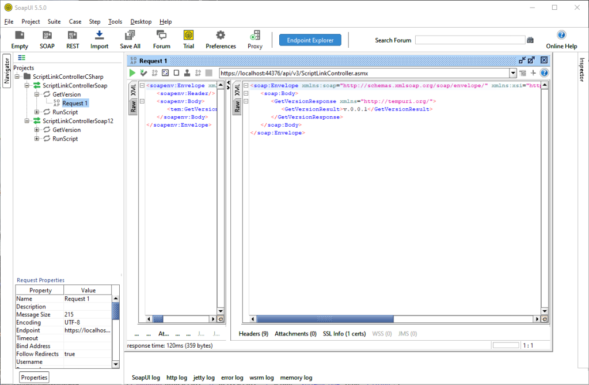

Welcome back to my series on getting started with myAvatar ScriptLink.
Today, we are looking at testing.
As tempting as it may be, we should not wait to test our ScriptLink APIs until they are available in production.
We want to test our code before it impacts the users.
In our first test, we will set up SoapUI to send a request to our development environment and verify the response.

When we left off, we had [created our first Hello World ScriptLink API in .NET using C#](/blog/creating-your-first-myavatar-scriptlink-api-using-c-sharp) and Visual Basic.
If we created them correctly, the we should be able to call the RunScript method with the HelloWorld parameter and receive an Error Code 3 with the ErrorMsg "Hello, World!'.
Let’s test that.

{/* truncate */}

## What You Will Need

To complete this walkthrough, you will need the following:

1. [Visual Studio Community 2019](https://visualstudio.microsoft.com/)
2. The Hello World solution we set up previously. I will be using the C# solution for my examples, but the process is the same for the Visual Basic solution.
3. [SoapUI](https://www.soapui.org/)

Visual Studio Community 2019 and SoapUI are free to download and use. Paid versions will add additional features that we will not use in this walkthrough.

If you don’t have your Hello World API setup yet, go back to my [previous article](/blog/creating-your-first-myavatar-scriptlink-api-using-c-sharp) to set it up.

## Start Your Web Application

Our first step is to open our solution in Visual Studio and run it.

1. Launch **Visual Studio 2019**.
2. **Open our ScriptLink demo solution**. For me, it is RS.ScriptLinkDemo.
3. Press **F5** to begin debugging the solution.
4. You may receive a security alert like this. This means that the browser does not trust the SSL certificate provided by Visual Studio. Go ahead and proceed.

5. If you see the default homepage of our web application like this, then you will need to enter the path to the ScriptLinkController.

6. Once you are at your ScriptLinkController API you should see a screen like this.

7. Confirm and copy the URL of your WSDL. Mine is: http://localhost:####/api/v3/ScriptLinkController.asmx?WSDL

## Import WSDL into SoapUI

Next, we will launch SoapUI and import our WSDL into a new test project.

1. Launch **SoapUI**.
2. Select **SOAP** in the Task bar to create a new SOAP Project.
3. **Paste the WSDL URL** into the *Initial WSDL* field.
4. Optional: Customize the Project name.
5. Select **OK**.

You should now have a SOAP project that looks something like this.

Ok. Let’s run some tests.

## Testing the API

For our first test, we are going to see what happens when we submit the default test.

### Test #1: GetVersion

Our first test will be relatively straightforward. We want to get our GetVersion string back. When we created the SOAP project, SoapUI created default requests for us.

1. **Expand GetVersion.** You can use either interface. However, I will be using the one that does not end in "12".
2. **Double-click on Request 1** to open it.
3. You should now see the default XML request displayed and ready for submission.

4. Select the **Play** icon (Alt+Enter) to submit request.
5. You should have received and XML response.

If the test was successful, then you should see the version number you set previously displayed in the GetVersionResult tag. If not, make sure your web application is still running.

## Test #2: Submitting Default OptionObject

Ok. Now for the real test.

1. **Expand the RunScript node**.
2. **Right-click on Request 1** and select **Rename**.
3. Name the request *Default Request* and select **OK**.

4. Double-click on the Default Request to open it.
5. You should now have a default OptionObject2015 on the left and an empty result view on the right.

6. Select the **Play** icon (Alt+Enter) to submit the request.
7. You should get a result like this.

So what happened? Three things happened. The submitted OptionObject2015 included the following invalid values:

* A `?` in EpisodeNumber.
* A `?` in ErrorCode.
* A `?` in MultipleIteration value.

To fix this:

1. Set the EpisodeNumber to 0.
2. Remove the ErrorCode and ErrorMesg tags. These are not relevant on submission anyway.
3. Set the MultipleIteration value to 0.

## Test #3: The Modified Default OptionObject

With the modifications in place your OptionObject request should look something like this.

Now when we run the test we should get an OptionObject2015 back. Did you?

If successful, you should see the ErrorCode "3" and ErrorMesg "Hello, World!" in the response XML.

## Save Your SoapUI Test Project

To help with future testing, let’s save our SoapUI test project. This should eliminate the need to import the WSDL again, unless we change ports.

1. Select **File->Save All Projects**.
2. You should receive a prompt indicating that the project has not been saved.
3. Select **Yes** to save the project.
4. Select a location for the project file and select **Save**.

## Happy Testing

There you go. You are all set to set testing your ScriptLink APIs with SoapUI. Enjoy!
