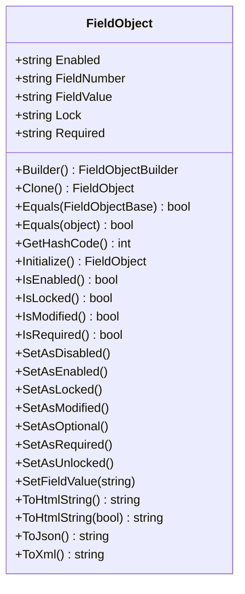
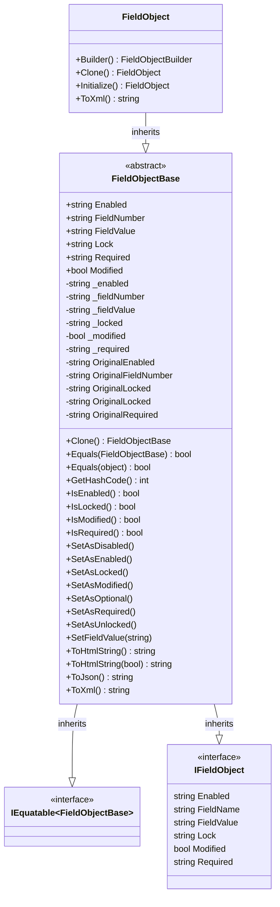

import Tabs from '@theme/Tabs';
import TabItem from '@theme/TabItem';

# FieldObject

The FieldObject represents a field on a myAvatar form.
AvatarScriptLink.NET adds several utility methods to assist with handlings these objects.



## Properties

| Property        | Description |
|:----------------|:------------|
| Enabled         | Gets or sets the Enabled value. The supported values are `0` (False) and `1` (True). |
| FieldNumber     | Gets or Sets the FieldNumber value. |
| FieldValue      | Gets or sets the FieldValue value. |
| Lock            | Gets or sets the Lock value. The supported values are `0` (False) and `1` (True). |
| Required        | Gets or sets the Required value. The supported values are `0` (False) and `1` (True). |

## Methods

| Method        | Description |
|:----------------|:------------|
| Builder() | Initializes a builder for constructing a FieldObject. |
| Clone() | Creates a copy of the FieldObject. |
| GetFieldValue() | Returns the FieldValue of a FieldObject. |
| Initialize() | Initializes an empty FieldObject. This FieldObject will be disabled, unlocked, and not required upon initialization. |
| IsEnabled() | Returns whether the FieldObject is enabled. |
| IsLocked() | Returns whether the FieldObject is locked. |
| IsModified() | Returns whether the FieldObject has been modified. |
| IsRequired() | Returns whether the FieldObject is required. | 
| SetAsDisabled() | Sets FieldObject as disabled and marks the FieldObject as modified. |
| SetAsEnabled() | Sets FieldObject as enabled and marks the FieldObject as modified. |
| SetAsLocked() | Sets FieldObject as locked and marks the FieldObject as modified. |
| SetAsModified() | Sets FieldObject as modified. |
| SetAsRequired() | Sets FieldObject as required and marks the FieldObject as modified. |
| SetAsUnlocked() | Sets FieldObject as unlocked and marks the FieldObject as modified. |
| SetFieldValue(string) | Sets the FieldValue of a FieldObject and marks the FieldObject as modified. |
| ToHtmlString(bool) | Returns the FieldObject as an HTML string. The `<html>`, `<head>`, and `<body>` tags can be included if desired. |
| ToJson() | Returns the FieldObject as a JSON string. |
| ToXml() | Returns the FieldObject as an XML string. |

## Examples

Most implementations would not require working with the FieldObject directly, however here is an example that uses the FieldObject to create an [FieldObject](../fieldobject) for Unit Testing.

<Tabs>
<TabItem value="cs" label="C#">

```cs
// Available in v.1.2 or later
[TestMethod]
public void TestMethod1WithFluentBuilder()
{
    var expected = "value";
    FieldObject fieldObject = FieldObject.Builder()
        .FieldNumber("123.45").FieldValue(expected)
        .Enabled()
        .Build();
    Assert.AreEqual(expected, fieldObject.FieldValue);
}

[TestMethod]
public void TestMethod1WithSimplifiedConstructor()
{
    var expected = "value";
    FieldObject fieldObject = new FieldObject
    {
        FieldNumber = "123.45",
        FieldValue = expected,
        Enabled = "1"
    };
    Assert.AreEqual(expected, fieldObject.FieldValue);
}
```

</TabItem>
<TabItem value="vb" label="Visual Basic">

```vb
' Available in v.1.2 or later
<TestMethod()> Public Sub TestMethod1WithFluentBuilder()
    Dim expected As String = "value"
    Dim fieldObject As FieldObject.Builder()
        .FieldNumber("123.45").FieldValue(expected)
        .Enabled()
        .Build()
    Assert.AreEqual(expected, fieldObject.FieldValue)
End Sub

<TestMethod()> Public Sub TestMethod1WithSimplifiedConstructor()
    Dim expected As String = "value"
    Dim fieldObject As New FieldObject With {
        .FieldNumber = "123.45",
        .FieldValue = expected,
        .Enabled = "1"
    }
    Assert.AreEqual(expected, fieldObject.FieldValue)
End Sub
```

</TabItem>
</Tabs>

## Detailed Class Diagram

