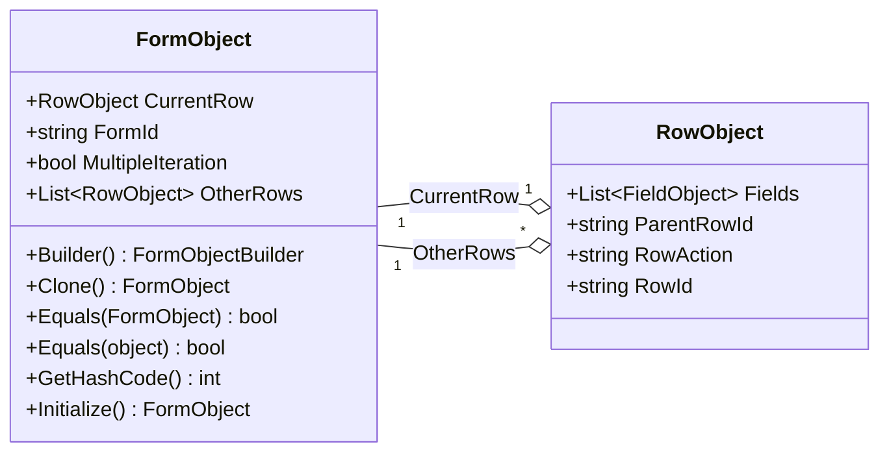
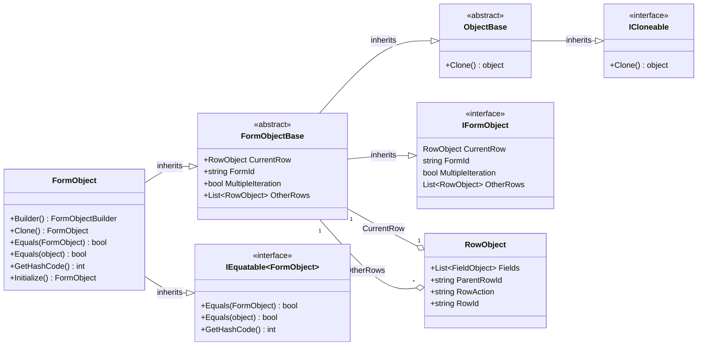

import Tabs from '@theme/Tabs';
import TabItem from '@theme/TabItem';

# FormObject

The FormObject represents a section of a myAvatar Form.
AvatarScriptLink.NET adds several utility methods to assist with handlings these objects.



## Properties

| Property          | Description |
|:------------------|:------------|
| CurrentRow        | The contents of this myAvatar Form section. The selected row on multiple iteration tables. |
| FormId            | The unique Id assigned to this section (FormObject). |
| MultipleIteration | Indicates whether this section uses a multiple iteration table. Note: this is not the same as TDE objects. |
| OtherRows         | Contains the contents of unselected rows in the multiple iteration table. |

## Methods

| Method                 | Description |
|:-----------------------|:------------|
| Builder()              | Initializes a builder for constructing a FormObject.   |
| Clone()                | Creates a copy of the FormObject.                      |
| Equals(FormObjectBase) | Used to compare two FormObject to determine if they are equal. Returns bool.            |
| Equals(object)         | Used to compare FormObject to an object to determine if they are equal. Returns bool.            |
| GetHashCode()          | Overrides the GetHashCode method for a FormObjectBase. |
| Initialize()           | Initializes an empty FormObject.                       |

## Examples

Most implementations would not require working with the FormObject directly, however here is an example that uses the FormObject to create an [OptionObject2015](../optionobject2015) for Unit Testing.

<Tabs>
<TabItem value="cs" label="C#">

```cs
// Available in v1.2 or later
[TestMethod]
public void TestMethod1WithFluentBuilder()
{
    var expected = "123";
    // FieldObject and RowObject definitions here 
    FormObject formObject = FormObject.Builder()
        .FormId(expected)
        .CurrentRow()
            .RowId("123||1")
            .Field(fieldObject1)
            .Field(fieldObject2)
            .AddRow()
        .MultipleIteration()
        .OtherRow()
            .RowId("123||2")
            .Field(fieldObject3)
            .Field(fieldObject4)
            .AddRow()
        .OtherRow(rowObject)
        .Build();
    Assert.AreEqual(expected, formObject.FormId);
}

[TestMethod]
public void TestMethod1WithSimplifiedConstructor()
{
    var expected = "123";
    FormObject formObject = new FormObject()
    {
        FormId = expected
    };
    Assert.AreEqual(expected, formObject.FormId);
}
```

</TabItem>
<TabItem value="vb" label="Visual Basic">

```vb
' Available in v1.2 or later
<TestMethod()> Public Sub TestMethod1WithFluentBuilder()
    Dim expected As String = "123"
    ' FieldObject and RowObject definitions here 
    Dim formObject As FormObject.Builder()
        .FormId(expected)
        .CurrentRow()
            .RowId("123||1")
            .Field(fieldObject1)
            .Field(fieldObject2)
            .AddRow()
        .MultipleIteration()
        .OtherRow()
            .RowId("123||2")
            .Field(fieldObject3)
            .Field(fieldObject4)
            .AddRow()
        .OtherRow(rowObject)
        .Build()
    Assert.AreEqual(expected, formObject.FormId)
End Sub


<TestMethod()> Public Sub TestMethod1WithSimplifiedConstructor()
    Dim expected As String = "123"
    Dim formObject As New FormObject With {
        .FormId = expected
    }
    Assert.AreEqual(expected, formObject.FormId)
End Sub
```

</TabItem>
</Tabs>

## Detailed Class Diagram

