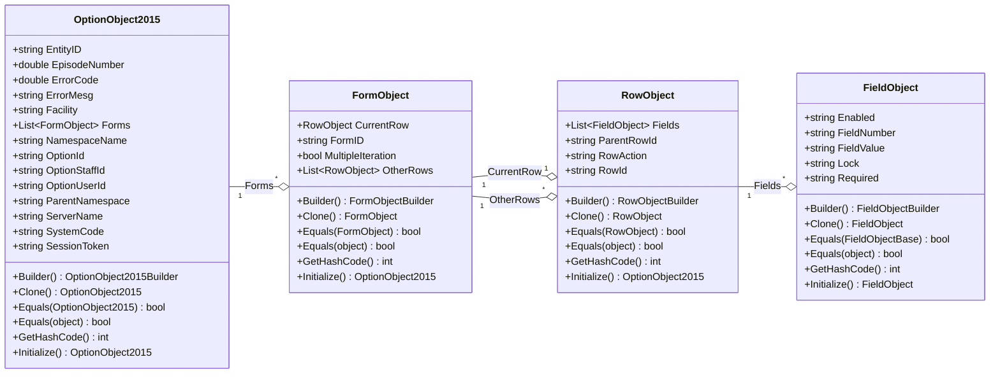
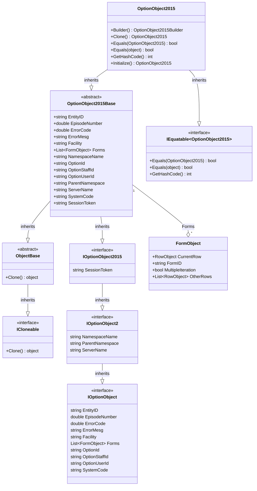

import Tabs from '@theme/Tabs';
import TabItem from '@theme/TabItem';

# OptionObject2015

The OptionObject2015 holds all of the content of and metadata describing the calling myAvatar form.
AvatarScriptLink.NET adds several utility methods to assist with handlings these objects.



Earlier versions of this object (i.e., [OptionObject2](../optionobject2) and [OptionObject](../optionobject)) are still supported and available for use within your projects as needed.

## Properties

| Property        | Description                                                                 |
|:----------------|:----------------------------------------------------------------------------|
| EntityID        | The unique Id of the selected entity. I.e., Patient, Staff, or User.        |
| EpisodeNumber   | The selected Episode Number. Will be null if the form is non-episodic.       |
| ErrorCode       | Informs myAvatar of the outcome of the ScriptLink API call.                 |
| ErrorMesg       | Message to display to user with certain error codes.                        |
| Facility        | The Facility Id the user is currently working in.                           |
| Forms           | List of myAvatar form sections including rows and fields. See [FormObject](../formobject). |
| NamespaceName   | The Namespace the user is currently working in.                             |
| OptionId        | The unique Id of the form that sent this request.                           |
| OptionStaffId   | The Staff Id assigned to the logged on user. May be null/empty if not associated with a Practitioner. |
| OptionUserId    | The User Id of the logged on user.                                          |
| ParentNamespace | The Parent Namespace of the Namespace the user is currently logged into.    |
| ServerName      | The server the request was submitted from.                                  |
| SystemCode      | The System Code the user is currently working in.                           |
| SessionToken    | The SessionToken that can be used to authenticate with Avatar Web Services. |

## Methods

The following methods are available on the OptionObject2015 to assist with common tasks.

| Method                   | Description |
|:-------------------------|:------------|
| Builder()                | Initializes a builder for constructing a OptionObject2015. |
| Clone()                  | Clones the OptionObject2015.                               |
| Equals(OptionObject2015) | Used to compare two OptionObject2015 to determine if they are equal. Returns bool.            |
| Equals(object)           | Used to compare OptionObject2015 to an object to determine if they are equal. Returns bool.            |
| GetHashCode()            | Overrides the GetHashCode method for a OptionObjectBase.   |
| Initialize()             | Initializes an empty OptionObject2015.                     |

## Examples

The following code shows how to use OptionObject2015 to construct a web service compatible with myAvatar.

### .NET

<Tabs groupId="syntax">
<TabItem value="cs" label="C#">

```cs title="MyScriptLinkDemoService.cs"
using RarelySimple.AvatarScriptLink.Objects;
using RarelySimple.AvatarScriptLink.Services;

namespace ScriptLinkDemo
{
    public class MyScriptLinkDemoService : IScriptLinkService2015
    {
        public string GetVersion()
        {
            return "0.1.0";
        }

        public OptionObject2015 RunScript(OptionObject2015 optionObject2015, string parameter)
        {
            return optionObject2015.ToReturnOptionObject(ErrorCode.Alert, "Hello World!");
        }
    }
}
```

</TabItem>
</Tabs>

### .NET Framework

<Tabs groupId="syntax">
<TabItem value="cs" label="C#">

```cs title="MyScriptLinkDemoService.asmx"
using RarelySimple.AvatarScriptLink.Objects;
using System.Web.Services;

namespace ScriptLinkDemo.Web.Api
{
    /// <summary>
    /// Summary description for MyScriptLinkDemoService
    /// </summary>
    [WebService(Namespace = "http://tempuri.org/")]
    [WebServiceBinding(ConformsTo = WsiProfiles.BasicProfile1_1)]
    [System.ComponentModel.ToolboxItem(false)]
    public class MyScriptLinkDemoService : System.Web.Services.WebService
    {
        [WebMethod]
        public string GetVersion()
        {
            return "v.0.0.1";
        }

        [WebMethod]
        public OptionObject2015 RunScript(OptionObject2015 optionObject2015, string parameters)
        {
            return optionObject2015.ToReturnOptionObject(ErrorCode.Alert, "Hello, World!");
        }
    }
}
```

</TabItem>
<TabItem value="vb" label="Visual Basic">

```vb title="MyScriptLinkDemoService.asmx"
Imports System.ComponentModel
Imports System.Web.Services
Imports RarelySimple.AvatarScriptLink.Objects

<System.Web.Services.WebService(Namespace:="http://tempuri.org/")> _
<System.Web.Services.WebServiceBinding(ConformsTo:=WsiProfiles.BasicProfile1_1)> _
<ToolboxItem(False)> _
Public Class MyScriptLinkDemoService
    Inherits System.Web.Services.WebService

    <WebMethod()>
    Public Function GetVersion() As String
        Return "v.0.0.1"
    End Function

    <WebMethod()>
    Public Function RunScript(ByVal optionObject2015 As OptionObject2015, ByVal parameters As String) As OptionObject2015
        Return optionObject2015.ToReturnOptionObject(ErrorCode.Alert, "Hello, World!")
    End Function

End Class
```

</TabItem>
</Tabs>

## Detailed Class Diagram


