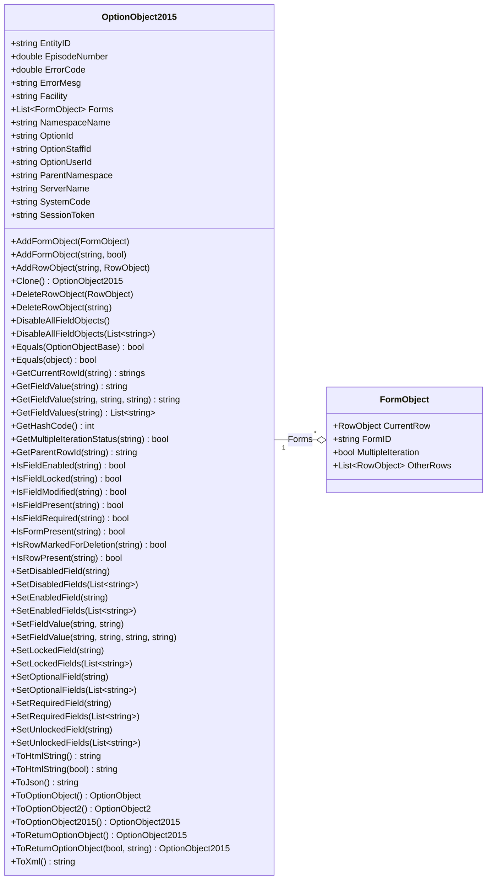

import Tabs from '@theme/Tabs';
import TabItem from '@theme/TabItem';

# OptionObject2015

The OptionObject2015 holds all of the content of and metadata describing the calling myAvatar form.
AvatarScriptLink.NET adds several utility methods to assist with handlings these objects.

:::note Legacy Support

Earlier versions of this object are still supported and available for use in your projects.

* [OptionObject2](../optionobject2)
* [OptionObject](../optionobject)

:::



## Properties

| Property        | Description                                                                 |
|:----------------|:----------------------------------------------------------------------------|
| EntityID        | The unique Id of the selected entity. I.e., Patient, Staff, or User.        |
| EpisodeNumber   | The selected Episode Number. Will be null if the form is non-episodic.       |
| ErrorCode       | Informs myAvatar of the outcome of the ScriptLink API call.                 |
| ErrorMesg       | Message to display to user with certain error codes.                        |
| Facility        | The Facility Id the user is currently working in.                           |
| Forms           | List of myAvatar form sections including rows and fields. See [FormObject](../formobject). |
| NamespaceName   | The Namespace the user is currently working in.                             |
| OptionId        | The unique Id of the form that sent this request.                           |
| OptionStaffId   | The Staff Id assigned to the logged on user. May be null/empty if not associated with a Practitioner. |
| OptionUserId    | The User Id of the logged on user.                                          |
| ParentNamespace | The Parent Namespace of the Namespace the user is currently logged into.    |
| ServerName      | The server the request was submitted from.                                  |
| SystemCode      | The System Code the user is currently working in.                           |
| SessionToken    | The SessionToken that can be used to authenticate with Avatar Web Services. |

## Methods

The following methods are available on the OptionObject2015 to assist with common tasks.

| Method                                        | Description |
|:----------------------------------------------|:------------|
| AddFormObject([FormObject](../formobject))     | Adds a [FormObject](../formobject) to the OptionObject2015.            |
| AddFormObject(string, bool)                   | Creates a [FormObject](../formobject) with specified FormId and adds to the OptionObject2015. The second parameter specifies whether the [FormObject](../formobject) should be flagged as a Multiple Iteration form. |
| AddRowObject(string, [RowObject](../rowobject))| Adds a [RowObject](../rowobject) to the [FormObject](../formobject) with the specified FormId. |
| Builder() | Initializes a builder for constructing a OptionObject2015. |
| Clone()                                        | Clones the OptionObject2015.            |
| DeleteRowObject([RowObject](../rowobject))     | Marks a <see cref="RowObject"/> for deletion.            |
| DeleteRowObject(string)                       | Marks a <see cref="RowObject"/> for deletion by specified RowId.            |
| DisableAllFieldObjects()                      | Sets all [FieldObjects](../fieldobject) as disabled.            |
| DisableAllFieldObjects(List of string)          | Sets all [FieldObjects](../fieldobject) as disabled except for any listed to be excluded.            |
| Equals(OptionObjectBase)                      | Used to compare two OptionObject2015 to determine if they are equal. Returns bool.            |
| Equals(object)                                | Used to compare OptionObject2015 to an object to determine if they are equal. Returns bool.            |
| GetCurrentRowId(string)                       | Returns the CurrentRow RowId of the form matching the FormId.            |
| GetFieldValue(string)                         | Returns the first value of the field matching the Field Number.            |
| GetFieldValue(string, string, string)         | Returns the value of the <see cref="FieldObject"/> matching the Field Number on the specified [FormObject](../formobject) and [RowObject](../rowobject).            |
| GetFieldValues(string)                        | Returns the values of the field matching the Field Number.            |
| GetHashCode()                                 | Overrides the GetHashCode method for a OptionObjectBase.            |
| GetMultipleIterationStatus(string)            | Returns the Multiple Iteration Status of the form matching the FormId.            |
| GetParentRowId(string)                        | Returns the CurrentRow ParentRowId of the form matching the FormId.            |
| Initialize() | Initializes an empty OptionObject2015. |
| IsFieldEnabled(string)                        | Returns whether the specified field is enabled.            |
| IsFieldLocked(string)                         | Returns whether the specified field is locked.            |
| IsFieldModified(string)                       | Returns whether the specified field is modified.            |
| IsFieldPresent(string)                        | Returns whether the specified field is present.            |
| IsFieldRequired(string)                       | Returns whether the specified field is required.            |
| IsFormPresent(string)                         | Returns whether the specified form is present.            |
| IsRowMarkedForDeletion(string)                | Returns whether the specified [RowObject](../rowobject) is marked for deletion.            |
| IsRowPresent(string)                          | Returns whether the specified row is present            |
| SetDisabledField(string)                      | Sets the specified field as disabled.            |
| SetDisabledFields(List of string)               | Sets the specified fields as disabled.            |
| SetEnabledField(string)                       | Sets the specified field as enabled.            |
| SetEnabledFields(List of string)                | Sets the specified fields as enabled.            |
| SetFieldValue(string, string)                 | Sets the FieldValue of a [FieldObject](../fieldobject) in the OptionObject2015 on the first form's CurrentRow.            |
| SetFieldValue(string, string, string, string) | Sets the FieldValue of a [FieldObject](../fieldobject) in the OptionObject2015.            |
| SetLockedField(string)                        | Sets the specified field as locked.            |
| SetLockedFields(List of string)                 | Sets the specified fields as disabled.            |
| SetOptionalField(string)                      | Set the specified field as not required and enables if disabled.            |
| SetOptionalFields(List of string)               | Set the specified fields as not required and enables if disabled.            |
| SetRequiredField(string)                      | Sets the specified field as required.            |
| SetRequiredFields(List of string)               | Sets the specified fields as required.            |
| SetUnlockedField(string)                      | Set the specified field as unlocked.            |
| SetUnlockedFields(List of string)               | Set the specified fields as unlocked.            |
| ToHtmlString()                                | Returns a string with all of the contents of the OptionObject2015 formatted in HTML. |
| ToHtmlString(bool)                            | Returns a string with all of the contents of the OptionObject2015 formatted in HTML. Passing true will include HTML header tags. |
| ToJson()                                      | Returns a string with all of the contents of the OptionObject2015 formatted as JSON.           |
| ToOptionObject()                              | Transforms the OptionObject2015 to an OptionObject.            |
| ToOptionObject2()                             | Transforms the OptionObject2015 as an OptionObject2.            |
| ToOptionObject2015()                          | Creates a clone of the OptionObject2015.            |
| ToReturnOptionObject()                        | Creates an OptionObject2015 with the minimum information required to return.            |
| ToReturnOptionObject(int, string)             | Creates an OptionObject2015 with the minimum information required to return plus the provided Error Code and Message.            |
| ToXml()                                       | Returns a string with all of the contents of the OptionObject2015 formatted as XML.           |

## Examples

The following code shows how to use OptionObject2015 to construct a web service compatible with myAvatar.

<Tabs groupId="syntax">
<TabItem value="cs" label="C#">

```cs title="MyScriptLinkDemoService.asmx"
using RarelySimple.AvatarScriptLink.Objects;
using System.Web.Services;

namespace ScriptLinkDemo.Web.Api
{
    /// <summary>
    /// Summary description for MyScriptLinkDemoService
    /// </summary>
    [WebService(Namespace = "http://tempuri.org/")]
    [WebServiceBinding(ConformsTo = WsiProfiles.BasicProfile1_1)]
    [System.ComponentModel.ToolboxItem(false)]
    public class MyScriptLinkDemoService : System.Web.Services.WebService
    {
        [WebMethod]
        public string GetVersion()
        {
            return "v.0.0.1";
        }

        [WebMethod]
        public OptionObject2015 RunScript(OptionObject2015 optionObject2015, string parameters)
        {
            return optionObject2015.ToReturnOptionObject(ErrorCode.Alert, "Hello, World!");
        }
    }
}
```

</TabItem>
<TabItem value="vb" label="Visual Basic">

```vb title="MyScriptLinkDemoService.asmx"
Imports System.ComponentModel
Imports System.Web.Services
Imports RarelySimple.AvatarScriptLink.Objects

<System.Web.Services.WebService(Namespace:="http://tempuri.org/")> _
<System.Web.Services.WebServiceBinding(ConformsTo:=WsiProfiles.BasicProfile1_1)> _
<ToolboxItem(False)> _
Public Class MyScriptLinkDemoService
    Inherits System.Web.Services.WebService

    <WebMethod()>
    Public Function GetVersion() As String
        Return "v.0.0.1"
    End Function

    <WebMethod()>
    Public Function RunScript(ByVal optionObject2015 As OptionObject2015, ByVal parameters As String) As OptionObject2015
        Return optionObject2015.ToReturnOptionObject(ErrorCode.Alert, "Hello, World!")
    End Function

End Class
```

</TabItem>
</Tabs>

## Detailed Class Diagram

```mermaid
classDiagram
class OptionObject2015 {
    +Clone() OptionObject2015
    +ToHtmlString() string
    +ToHtmlString(bool) string
    +ToOptionObject() OptionObject
    +ToOptionObject2() OptionObject2
    +ToOptionObject2015() OptionObject2015
    +ToReturnOptionObject() OptionObject2015
    +ToReturnOptionObject(bool, string) OptionObject2015
    +ToXml() string
}

class OptionObjectBase {
    +string EntityID
    +double EpisodeNumber
    +double ErrorCode
    +string ErrorMesg
    +string Facility
    +List~FormObject~ Forms
    +string NamespaceName
    +string OptionId
    +string OptionStaffId
    +string OptionUserId
    +string ParentNamespace
    +string ServerName
    +string SystemCode
    +string SessionToken
    +AddFormObject(FormObject)
    +AddFormObject(string, bool)
    +AddRowObject(string, RowObject)
    +Clone() OptionObjectBase
    +DeleteRowObject(RowObject)
    +DeleteRowObject(string)
    +DisableAllFieldObjects()
    +DisableAllFieldObjects(List~string~)
    +Equals(OptionObjectBase) bool
    +Equals(object) bool
    +GetCurrentRowId(string) strings
    +GetFieldValue(string) string
    +GetFieldValue(string, string, string) string
    +GetFieldValues(string) List~string~
    +GetHashCode() int
    +GetMultipleIterationStatus(string) bool
    +GetParentRowId(string) string
    +IsFieldEnabled(string) bool
    +IsFieldLocked(string) bool
    +IsFieldModified(string) bool
    +IsFieldPresent(string) bool
    +IsFieldRequired(string) bool
    +IsFormPresent(string) bool
    +IsRowMarkedForDeletion(string) bool
    +IsRowPresent(string) bool
    +SetDisabledField(string)
    +SetDisabledFields(List~string~)
    +SetEnabledField(string)
    +SetEnabledFields(List~string~)
    +SetFieldValue(string, string)
    +SetFieldValue(string, string, string, string)
    +SetLockedField(string)
    +SetLockedFields(List~string~)
    +SetOptionalField(string)
    +SetOptionalFields(List~string~)
    +SetRequiredField(string)
    +SetRequiredFields(List~string~)
    +SetUnlockedField(string)
    +SetUnlockedFields(List~string~)
    +ToHtmlString() string
    +ToHtmlString(bool) string
    +ToJson() string
    +ToOptionObject()* OptionObject
    +ToOptionObject2()* OptionObject2
    +ToOptionObject2015()* OptionObject2015
    +ToReturnOptionObject() OptionObjectBase
    +ToReturnOptionObject(double, string) OptionObjectBase
    +ToXml() string
    -AreBothEmpty(List~FormObject~, List~FormObject~)$ bool
    -AreBothNull(List~FormObject~, List~FormObject~)$ bool
    -AreFormsEqual(List~FormObject~, List~FormObject~)$ bool
}
<<abstract>> OptionObjectBase

class IOptionObject2015 {
    string SessionToken
}
<<interface>> IOptionObject2015

class IOptionObject2 {
    string NamespaceName
    string ParentNamespace
    string ServerName
}
<<interface>> IOptionObject2

class IOptionObject {
    string EntityID
    double EpisodeNumber
    double ErrorCode
    string ErrorMesg
    string Facility
    List~FormObject~ Forms
    string OptionId
    string OptionStaffId
    string OptionUserId
    string SystemCode
}
<<interface>> IOptionObject

class FormObject {
    +RowObject CurrentRow
    +string FormID
    +bool MultipleIteration
    +List~RowObject~ OtherRows
}

class IEquatable~OptionObjectBase~
<<interface>> IEquatable~OptionObjectBase~

OptionObjectBase "1" --o "*" FormObject : Forms

OptionObject2015 --|> OptionObjectBase : inherits
OptionObjectBase --|> IEquatable~OptionObjectBase~ : inherits
OptionObjectBase --|> IOptionObject2015 : inherits
IOptionObject2015 --|> IOptionObject2 : inherits
IOptionObject2 --|> IOptionObject : inherits

click FormObject href "./formobject" "Learn more about the FormObject"
```


