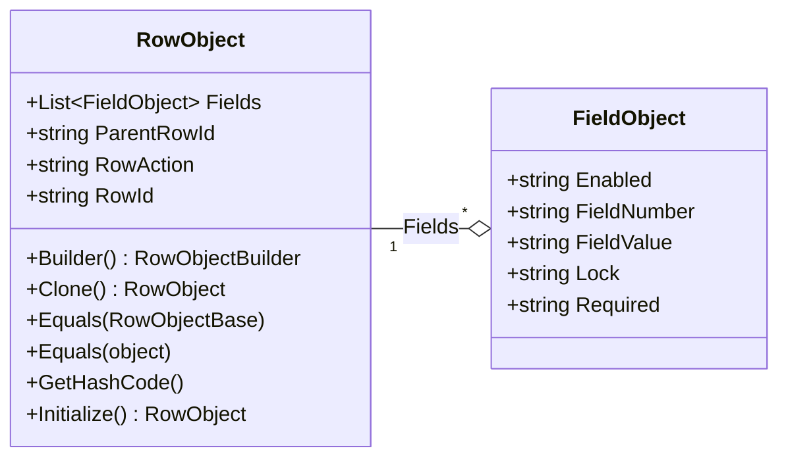
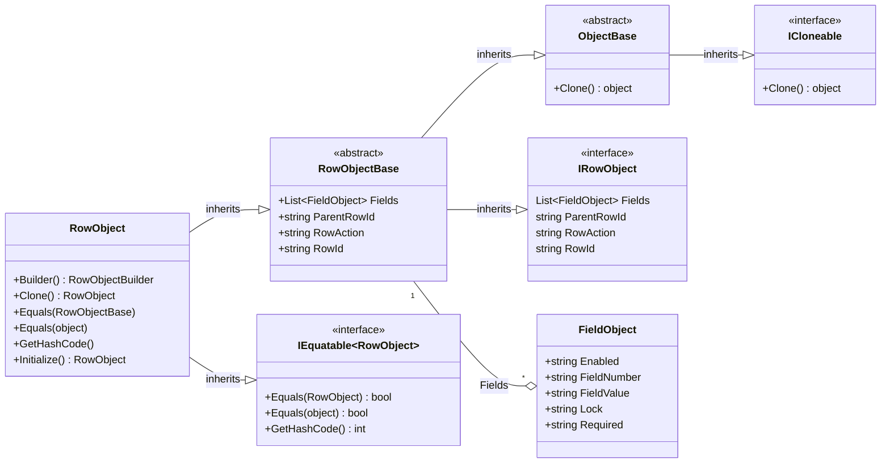

import Tabs from '@theme/Tabs';
import TabItem from '@theme/TabItem';

# RowObject

The RowObject represents the contents of a myAvatar form section. I.e., the collection of FieldObjects that make up the section.
AvatarScriptLink.NET adds several utility methods to assist with handlings these objects.



## Properties

| Property        | Description |
|:----------------|:------------|
| Fields          | Gets or sets the Fields value.      |
| ParentRowId     | Gets or Sets the ParentRowId value. |
| RowAction       | Gets or sets the RowAction value. The supported case-sensitive values are blank, `ADD`, `EDIT`, and `DELETE`. |
| RowId           | Gets or set the RowId value.        |

## Methods

| Method        | Description |
|:----------------|:------------|
| Builder() | Initializes a builder for constructing a RowObject. |
| Clone() | Creates a copy of the RowObject. |
| Initialize() | Initializes an empty RowObject. This RowAction will be set to None upon initialization. |

## Examples

Most implementations would not require working with the RowObject directly, however here is an example that uses the RowObject to create an [OptionObject2015](../optionobject2015) for Unit Testing.

<Tabs>
<TabItem value="cs" label="C#">

```cs
// Available in v1.2 or later
[TestMethod]
public void TestMethod1WithFluentBuilder()
{
    var expected = "123||1";
    RowObject rowObject = RowObject.Builder()
        .RowId(expected)
        .Field().FieldNumber("246.80").FieldValue("Sample").Enabled().AddField()
        .Edit()
        .Build();
    Assert.AreEqual(expected, rowObject.RowId);
}

[TestMethod]
public void TestMethod1WithSimplifiedConstructor()
{
    var expected = "123||1";
    FieldObject fieldObject = new FieldObject
    {
        FieldNumber = "246.80",
        FieldValue = "Sample",
        Enabled = "1"
    };
    RowObject rowObject = new RowObject
    {
        RowId = expected,
        RowAction = "EDIT"
    };
    rowObject.AddFieldObject(fieldObject);
    Assert.AreEqual(expected, rowObject.RowId);
}
```

</TabItem>
<TabItem value="vb" label="Visual Basic">

```vb
' Available in v1.2 or later
<TestMethod()> Public Sub TestMethod1WithFluentBuilder()
    Dim expected As String = "123||1"
    Dim rowObject As RowObject.Builder()
        .RowId(expected)
        .Field().FieldNumber("246.80").FieldValue("Sample").Enabled().AddField()
        .Edit()
        .Build();
    Assert.AreEqual(expected, rowObject.RowId)
End Sub

<TestMethod()> Public Sub TestMethod1WithSimplifiedConstructor()
    Dim expected As String = "123||1"
    Dim fieldObject As New FieldObject With {
        .FieldNumber = "246.80",
        .FieldValue = "Sample",
        .Enabled = "1"
    }
    Dim rowObject As New RowObject With {
        .RowId = expected,
        .RowAction = "EDIT"
    }
    rowObject.AddFieldObject(fieldObject)
    Assert.AreEqual(expected, rowObject.RowId)
End Sub
```

</TabItem>
</Tabs>

## Detailed Class Diagram

