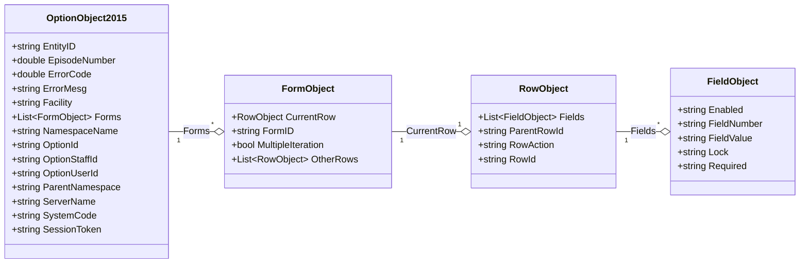
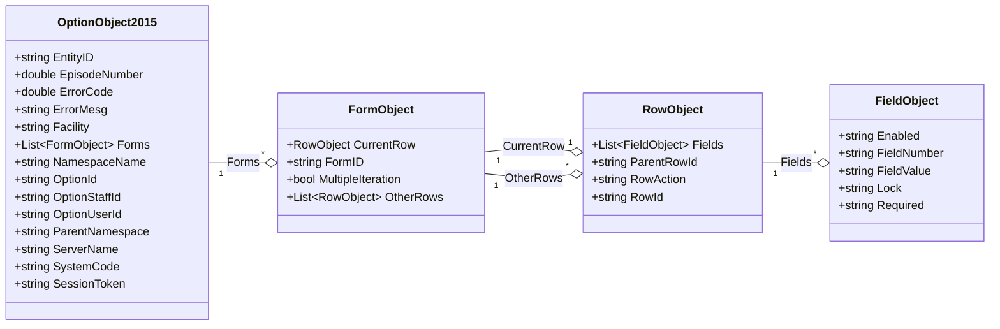

# Data Model

Netsmart has defined the data model to use with Avatar ScriptLink to support consitent integration with any SOAP API that can support the data model and security requirements.
This includes some coded values (I.e., `ErrorCode` and `RowAction`) that the AvatarScriptLink.NET library defines classes for.
Additionally, the AvatarScriptLink.NET library expands on the data model to assist with common implementation designs.

## Avatar ScriptLink

The request and response payloads consist of an OptionObject2015 as defined in your APIs WSDL.

### Standard

A standard form in myAvatar will include only a single RowObject containing all fields on that form.

### Multiple Iteration

When a myAvatar form (OptionObject2015) includes a multiple iteration table in one or more of the sections (FormObject), the selected RowObject will be in the CurrentRow and any other rows in OtherRows.
Multiple Iteration Tables can never be ther first section (FormObject) on a myAvatar form.

## AvatarScriptLink.NET

The following have been implemented as part of the AvatarScriptLink.NET library to assist with writing and troubleshooting ScriptLink APIs.

### ErrorCode

Avatar ScriptLink APIs must respond with an ErrorCode (i.e., Status Code).
The valid codes are defined by myAvatar and are listed below with their helper class equivalents.

[Learn more](./errorcode)

### FieldAction

*This is a utility class leveraged by the library internally and is not required in the most common use cases.*

The FieldAction class is used within the AvatarScriptLink.NET to indicate which action is to be performed on a FieldObject.

| Action   | Description                                         |
|:---------|:----------------------------------------------------|
| Disable  | Instructs method to disable a FieldObject.          |
| Enable   | Instructs method to enable a FieldObject.           |
| Lock     | Instructs method to lock a FieldObject.             |
| Modify   | Instructs method to mark a FieldObject as modified. |
| Optional | Instructs method to mark a FieldObject as optional. |
| Require  | Instructs method to mark a FieldObject as required. |
| Unlock   | Instructs method to unlock a FieldObject.           |

### Parameter

Avatar ScriptLink allows parameters to be defined when configuring myAvatar to call your ScriptLink API.
Typically, implementers will delimit this parameter to allow the passing of multiple values to the API to modify the behavior.
The Parameter class helps to parse the delimited parameter string.

### RowAction

The RowAction class is used to help you return valid RowAction values to myAvatar.
These values instruct myAvatar to add, edit, or delete a RowObject upon receipt of the response from the ScriptLink API.

[Learn more](./rowaction)