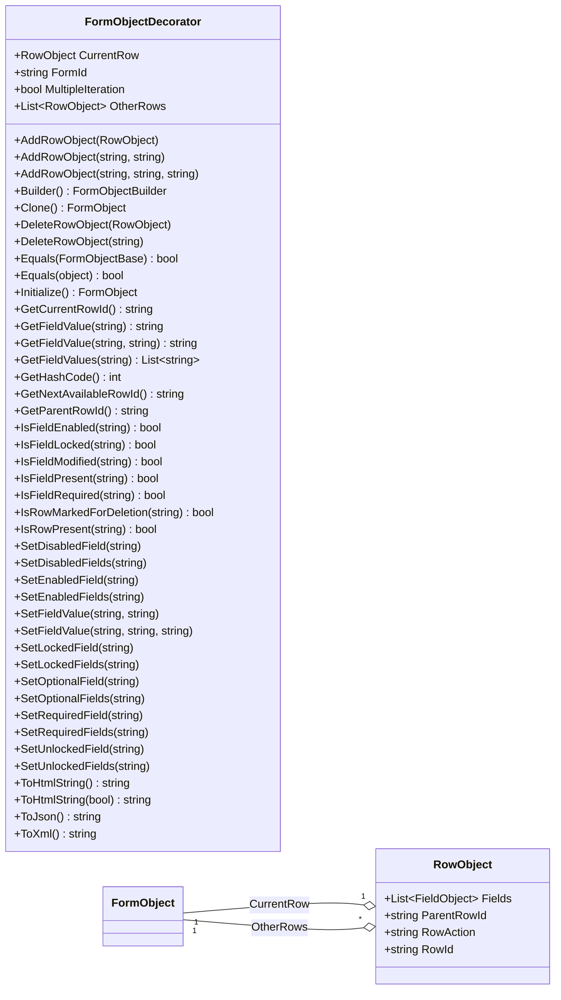
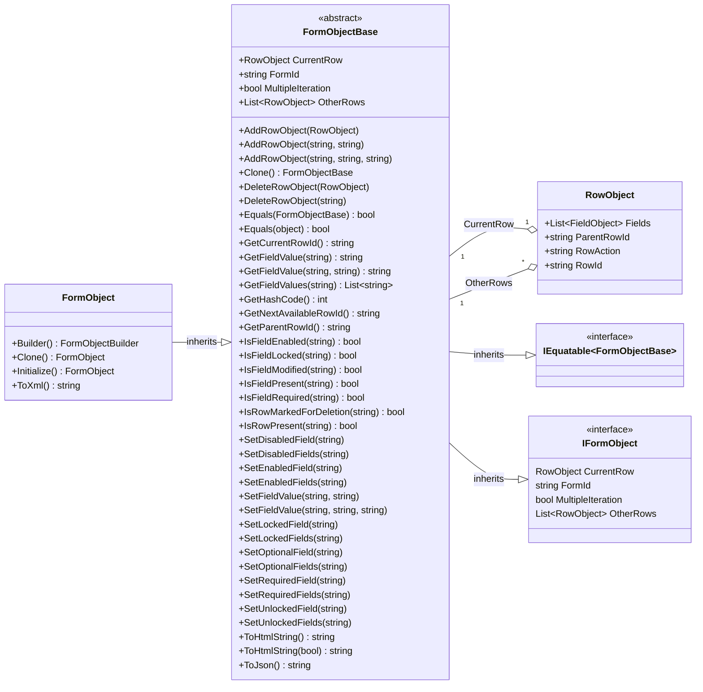

import Tabs from '@theme/Tabs';
import TabItem from '@theme/TabItem';

The FormObject represents a section of a myAvatar Form.
The FormObjectDecorator adds several utility methods to assist with handlings these objects.



## Properties

| Property          | Description |
|:------------------|:------------|
| CurrentRow        | The contents of this myAvatar Form section. The selected row on multiple iteration tables. |
| FormId            | The unique Id assigned to this section (FormObject). |
| MultipleIteration | Indicates whether this section uses a multiple iteration table. Note: this is not the same as TDE objects. |
| OtherRows         | Contains the contents of unselected rows in the multiple iteration table. |

## Methods

| Method        | Description |
|:----------------|:------------|
| AddRowObject([RowObject](../rowobject)) | Adds a [RowObject](../rowobject) to a the FormObject. |
| AddRowObject(string, string) | Adds a [RowObject](../rowobject) to a FormObject using supplied RowId and ParentRowId. |
| AddRowObject(string, string, string) | Adds a [RowObject](../rowobject) to a FormObject using supplied RowId and ParentRowId and setting the RowAction. |
| Builder() | Initializes a builder for constructing a FormObject. |
| Clone() | Creates a copy of the FormObject. |
| DeleteRowObject([RowObject](../rowobject)) | Removes a [RowObject](../rowobject) from a FormObject. |
| DeleteRowObject(string) | Removes a [RowObject](../rowobject) from a FormObject by RowId. |
| Equals(FormObjectBase)                      | Used to compare two FormObject to determine if they are equal. Returns bool.            |
| Equals(object)                                | Used to compare FormObject to an object to determine if they are equal. Returns bool.            |
| GetCurrentRowId() | Returns the ID of the [RowObject](../rowobject) in the CurrentRow of a FormObject. |
| GetHashCode()                                 | Overrides the GetHashCode method for a FormObjectBase.            |
| GetFieldValue(string) | Returns the FieldValue of a [FieldObject](../fieldobject) in a FormObject by FieldNumber. |
| GetFieldValue(string, string) | Returns the FieldValue of a [FieldObject](../fieldobject) in a FormObject by RowId and FieldNumber. |
| GetFieldValues(string) | Returns a List&lt;string&gt; of FieldValues in a FormObject by FieldNumber. |
| GetNextAvailableRowId() | Returns the next available RowId for the FormObject. |
| GetParentRowId() | Returns the ParentRowId of the FormObject.CurrentRow. |
| Initialize() | Initializes an empty FormObject. |
| IsFieldEnabled(string) | Returns whether a [FieldObject](../fieldobject) in a FormObject is enabled by FieldNumber. |
| IsFieldLocked(string) | Returns whether a [FieldObject](../fieldobject) in a FormObject is locked by FieldNumber. |
| IsFieldModified(string) | Returns whether a [FieldObject](../fieldobject) in a FormObject is modified by FieldNumber. |
| IsFieldPresent(string) | Returns whether a [FieldObject](../fieldobject) in a FormObject is present by FieldNumber. |
| IsFieldRequired(string) | Returns whether a [FieldObject](../fieldobject) in a FormObject is required by FieldNumber. |
| IsRowMarkedForDeletion(string) | Returns whether a [RowObject](../rowobject) in a FormObject is marked for deletion by RowId. |
| IsRowPresent(string) | Returns whether a [RowObject](../rowobject) in a FormObject is present by RowId. |  
| SetDisabledField(string) | Sets a [FieldObject](../fieldobject) in a FormObject as disabled by FieldNumber. |
| SetDisabledFields(List&lt;string&gt;) | Sets [FieldObjects](../fieldobject) in a FormObject as disabled by FieldNumbers. |
| SetDisabledFields(string) | Sets the [FieldObjects](../fieldobject) in a FormObject as disabled by FieldNumber. If [FieldObject](../fieldobject) is in a multiple iteration FormObject then all occurances will be set as disabled. |
| SetEnabledField(string) | Sets a [FieldObject](../fieldobject) in a FormObject as enabled by FieldNumber. |
| SetEnabledFields(List&lt;string&gt;) | Sets [FieldObjects](../fieldobject) in a FormObject as enabled by FieldNumbers. |
| SetEnabledFields(string) | Sets the [FieldObjects](../fieldobject) in a FormObject as enabled by FieldNumber. If [FieldObject](../fieldobject) is in a multiple iteration FormObject then all occurances will be set as disabled. |
| SetFieldValue(string, string) | Sets the FieldValue of a [FieldObject](../fieldobject) in the FormObject.CurrentRow by FieldNumber. |
| SetFieldValue(string, string, string) | Sets the FieldValue a [FieldObject](../fieldobject) in the FormObject by RowId and FieldNumber. |
| SetLockedField(string) | Set the [FieldObject](../fieldobject) in a FormObject as locked by FieldNumber. If [FieldObject](../fieldobject) is in a multiple iteration FormObject then all occurances will be set as locked. |
| SetLockedFields(List&lt;string&gt;) | Sets [FieldObjects](../fieldobject) in a FormObject as locked by FieldNumbers. |
| SetLockedFields(string) | Sets the [FieldObjects](../fieldobject) in a FormObject as locked by FieldNumber. If [FieldObject](../fieldobject) is in a multiple iteration FormObject then all occurances will be set as locked. |
| SetOptionalField(string) | Sets the [FieldObject](../fieldobject) in a FormObject as enabled and not required by FieldNumber. If [FieldObject](../fieldobject) is in a multiple iteration FormObject then all occurances will be set as enabled and not required. |
| SetOptionalFields(List&lt;string&gt;) | Sets [FieldObjects](../fieldobject) in a FormObject as enabled and not required by FieldNumbers. |
| SetOptionalFields(string) | Sets the [FieldObjects](../fieldobject) in a FormObject as enabled and not required by FieldNumber. If [FieldObject](../fieldobject) is in a multiple iteration FormObject then all occurances will be set as enabled and not required. |
| SetRequiredField(string) | Sets the [FieldObject](../fieldobject) in a FormObject as enabled and required by FieldNumber. If [FieldObject](../fieldobject) is in a multiple iteration FormObject then all occurances will be set as enabled and required. |
| SetRequiredFields(List&lt;string&gt;) | Sets [FieldObjects](../fieldobject) in a FormObject as enabled and required by FieldNumbers. |
| SetRequiredFields(string) | Sets the [FieldObjects](../fieldobject) in a FormObject as enabled and required by FieldNumber. If [FieldObject](../fieldobject) is in a multiple iteration FormObject then all occurances will be set as enabled and required. |
| SetUnlockedField(string) | Sets the [FieldObject](../fieldobject) in a FormObject as unlocked by FieldNumber. If [FieldObject](../fieldobject) is in a multiple iteration FormObject then all occurances will be set as unlocked. |
| SetUnlockedFields(List&lt;string&gt;) | Sets [FieldObjects](../fieldobject) in a FormObject as unlocked by FieldNumbers. |
| SetUnlockedFields(string) | Sets the [FieldObjects](../fieldobject) in a FormObject as unlocked by FieldNumber. If [FieldObject](../fieldobject) is in a multiple iteration FormObject then all occurances will be set as unlocked. |
| ToHtmlString() | Returns the FormObject as an HTML string. The `<html>`, `<head>`, and `<body>` tags can be included if desired. |
| ToHtmlString(bool) | Returns the FormObject as an HTML string. The `<html>`, `<head>`, and `<body>` tags can be included if desired. |
| ToJson() | Returns the FormObject as a JSON string. |
| ToXml() | Returns the FormObject as an XML string. |

## Examples

Most implementations would not require working with the FormObject directly, however here is an example that uses the FormObject to create an [OptionObject2015](../optionobject2015) for Unit Testing.

<Tabs>
<TabItem value="cs" label="C#">

```cs
// Available in v1.2 or later
[TestMethod]
public void TestMethod1WithFluentBuilder()
{
    var expected = "123";
    // FieldObject and RowObject definitions here 
    FormObject formObject = FormObject.Builder()
        .FormId(expected)
        .CurrentRow()
            .RowId("123||1")
            .Field(fieldObject1)
            .Field(fieldObject2)
            .AddRow()
        .MultipleIteration()
        .OtherRow()
            .RowId("123||2")
            .Field(fieldObject3)
            .Field(fieldObject4)
            .AddRow()
        .OtherRow(rowObject)
        .Build();
    Assert.AreEqual(expected, formObject.FormId);
}

[TestMethod]
public void TestMethod1WithSimplifiedConstructor()
{
    var expected = "123";
    FormObject formObject = new FormObject()
    {
        FormId = expected
    };
    Assert.AreEqual(expected, formObject.FormId);
}
```

</TabItem>
<TabItem value="vb" label="Visual Basic">

```vb
' Available in v1.2 or later
<TestMethod()> Public Sub TestMethod1WithFluentBuilder()
    Dim expected As String = "123"
    ' FieldObject and RowObject definitions here 
    Dim formObject As FormObject.Builder()
        .FormId(expected)
        .CurrentRow()
            .RowId("123||1")
            .Field(fieldObject1)
            .Field(fieldObject2)
            .AddRow()
        .MultipleIteration()
        .OtherRow()
            .RowId("123||2")
            .Field(fieldObject3)
            .Field(fieldObject4)
            .AddRow()
        .OtherRow(rowObject)
        .Build()
    Assert.AreEqual(expected, formObject.FormId)
End Sub


<TestMethod()> Public Sub TestMethod1WithSimplifiedConstructor()
    Dim expected As String = "123"
    Dim formObject As New FormObject With {
        .FormId = expected
    }
    Assert.AreEqual(expected, formObject.FormId)
End Sub
```

</TabItem>
</Tabs>

## Detailed Class Diagram

