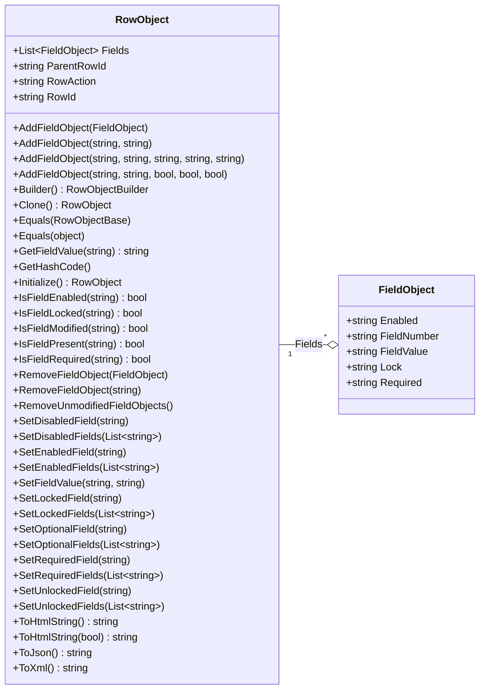
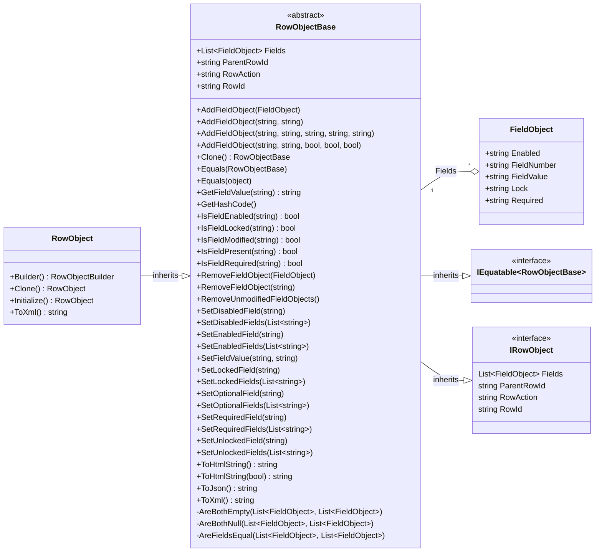

import Tabs from '@theme/Tabs';
import TabItem from '@theme/TabItem';

# RowObject

The RowObject represents the contents of a myAvatar form section. I.e., the collection of FieldObjects that make up the section.
AvatarScriptLink.NET adds several utility methods to assist with handlings these objects.



## Properties

| Property        | Description |
|:----------------|:------------|
| Fields          | Gets or sets the Fields value. |
| ParentRowId     | Gets or Sets the ParentRowId value. |
| RowAction       | Gets or sets the RowAction value. The supported case-sensitive values are blank, `ADD`, `EDIT`, and `DELETE`. |
| RowId           | Gets or set the RowId value. |

## Methods

| Method        | Description |
|:----------------|:------------|
| AddFieldObject([FieldObject](../fieldobject)) | Adds a [FieldObject](../fieldobject) to a the RowObject. |
| AddFieldObject(string, string) | Adds a [FieldObject](../fieldobject) to a RowObject using supplied FieldNumber and FieldValue. |
| AddFieldObject(string, string, string, string, string) | Adds a [FieldObject](../fieldobject) to a RowObject using supplied FieldNumber and FieldValue and setting the Enabled, Locked, and Required values (e.g., `Y` or `N`). |
| AddFieldObject(string, string, bool, bool, bool) | Adds a [FieldObject](../fieldobject) to a RowObject using supplied FieldNumber and FieldValue and setting the Enabled, Locked, and Required values. |
| Builder() | Initializes a builder for constructing a RowObject. |
| Clone() | Creates a copy of the RowObject. |
| GetFieldValue(string) | Returns the FieldValue of a [FieldObject](../fieldobject) in a RowObject by FieldNumber. |
| Initialize() | Initializes an empty RowObject. This RowAction will be set to None upon initialization. |
| IsFieldEnabled(string) | Returns whether a [FieldObject](../fieldobject) in a RowObject is enabled by FieldNumber. |
| IsFieldLocked(string) | Returns whether a [FieldObject](../fieldobject) in a RowObject is locked by FieldNumber. |
| IsFieldPresent(string) | Returns whether a [FieldObject](../fieldobject) in a RowObject is present by FieldNumber. |
| IsFieldRequired(string) | Returns whether a [FieldObject](../fieldobject) in a RowObject is required by FieldNumber. |
| RemoveFieldObject([FieldObject](../fieldobject)) | Removes a [FieldObject](../fieldobject) from a RowObject. |
| RemoveFieldObject(string) | Removes a [FieldObject](../fieldobject) from a RowObject by FieldNumber. |
| RemoveUnmodifiedFieldObjects() | Removes [FieldObjects](../fieldobject) from RowObject that have not been modified. |  
| SetDisabledField(string) | Sets the [FieldObject](../fieldobject) in a RowObject as disabled by FieldNumber. |
| SetDisabledFields(List&lt;string&gt;) | Sets [FieldObjects](../fieldobject) in a RowObject as disabled by FieldNumbers. |
| SetFieldValue(string, string) | Sets the FieldValue of a [FieldObject](../fieldobject) in the RowObject by FieldNumber. |
| SetLockedField(string) | Sets the [FieldObject](../fieldobject) in a RowObject as locked by FieldNumber. |
| SetLockedFields(List&lt;string&gt;) | Sets [FieldObjects](../fieldobject) in a RowObject as locked by FieldNumbers. |
| SetOptionalField(string) | Sets the [FieldObject](../fieldobject) in a RowObject as enabled and not required by FieldNumber. |
| SetOptionalFields(List&lt;string&gt;) | Sets [FieldObjects](../fieldobject) in a RowObject as enabled and not required by FieldNumbers. |
| SetRequiredField(string) | Sets the [FieldObject](../fieldobject) in a RowObject as enabled and required by FieldNumber. |
| SetRequiredFields(List&lt;string&gt;) | Sets [FieldObjects](../fieldobject) in a RowObject as enabled and required by FieldNumbers. |
| SetUnlockedField(string) | Sets the [FieldObject](../fieldobject) in a RowObject as unlocked by FieldNumber. |
| SetUnlockedFields(List&lt;string&gt;) | Sets [FieldObjects](../fieldobject) in a RowObject as unlocked by FieldNumbers. |
| ToHtmlString(bool) | Returns the RowObject as an HTML string. The `<html>`, `<head>`, and `<body>` tags can be included if desired. |
| ToJson() | Returns the RowObject as a JSON string. |
| ToXml() | Returns the RowObject as an XML string. |

## Examples

Most implementations would not require working with the RowObject directly, however here is an example that uses the RowObject to create an [OptionObject2015](../optionobject2015) for Unit Testing.

<Tabs>
<TabItem value="cs" label="C#">

```cs
// Available in v1.2 or later
[TestMethod]
public void TestMethod1WithFluentBuilder()
{
    var expected = "123||1";
    RowObject rowObject = RowObject.Builder()
        .RowId(expected)
        .Field().FieldNumber("246.80").FieldValue("Sample").Enabled().AddField()
        .Edit()
        .Build();
    Assert.AreEqual(expected, rowObject.RowId);
}

[TestMethod]
public void TestMethod1WithSimplifiedConstructor()
{
    var expected = "123||1";
    FieldObject fieldObject = new FieldObject
    {
        FieldNumber = "246.80",
        FieldValue = "Sample",
        Enabled = "1"
    };
    RowObject rowObject = new RowObject
    {
        RowId = expected,
        RowAction = "EDIT"
    };
    rowObject.AddFieldObject(fieldObject);
    Assert.AreEqual(expected, rowObject.RowId);
}
```

</TabItem>
<TabItem value="vb" label="Visual Basic">

```vb
' Available in v1.2 or later
<TestMethod()> Public Sub TestMethod1WithFluentBuilder()
    Dim expected As String = "123||1"
    Dim rowObject As RowObject.Builder()
        .RowId(expected)
        .Field().FieldNumber("246.80").FieldValue("Sample").Enabled().AddField()
        .Edit()
        .Build();
    Assert.AreEqual(expected, rowObject.RowId)
End Sub

<TestMethod()> Public Sub TestMethod1WithSimplifiedConstructor()
    Dim expected As String = "123||1"
    Dim fieldObject As New FieldObject With {
        .FieldNumber = "246.80",
        .FieldValue = "Sample",
        .Enabled = "1"
    }
    Dim rowObject As New RowObject With {
        .RowId = expected,
        .RowAction = "EDIT"
    }
    rowObject.AddFieldObject(fieldObject)
    Assert.AreEqual(expected, rowObject.RowId)
End Sub
```

</TabItem>
</Tabs>

## Detailed Class Diagram

